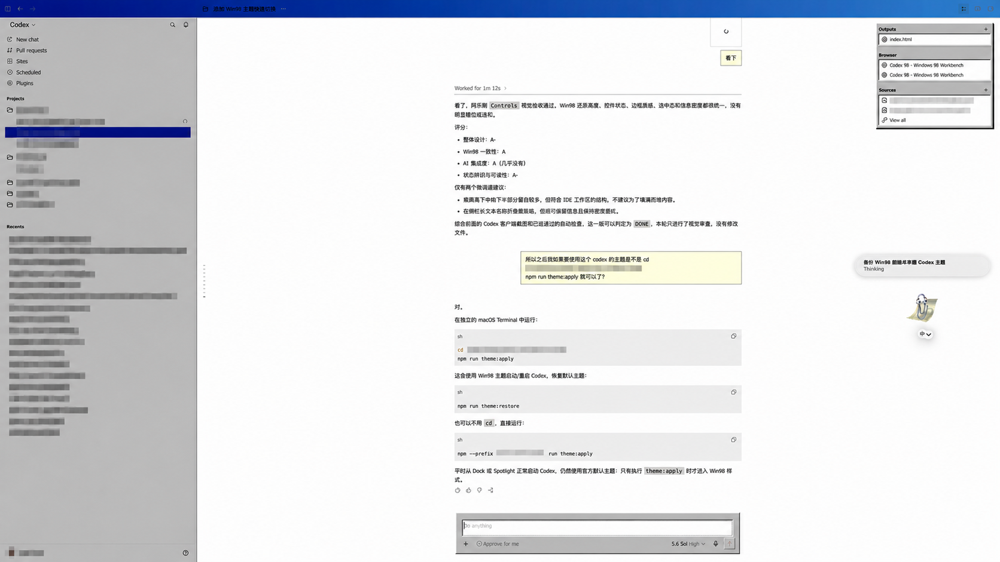

# Codex 98

[English](README.md)

Codex 98 是用于 ChatGPT 桌面客户端 **Codex 视图**的非官方 Windows 98 风格主题。它使用直角控件、经典系统配色、凸起与凹陷边框、紧凑排版和高对比交互状态，替代现代圆角与半透明界面。

完整皮肤只在当前桌面客户端会话中生效，不修改已安装的应用程序包、`app.asar`、二进制文件或代码签名。

> [!IMPORTANT]
> Codex 98 是独立项目，与 Microsoft、OpenAI、CodeDrobe 不存在从属、背书或赞助关系。

## 效果预览



## 平台支持

| 平台 | 完整皮肤 | 原生降级版 | 说明 |
|---|---|---|---|
| macOS | 预览版 | 支持 | 主要视觉测试平台；客户端更新可能破坏私有 DOM 选择器。 |
| Windows 11、Microsoft Store 客户端 | 实验性 | 支持 | CodeDrobe 上游已验证应用/重启链路；Codex 98 仍缺少完整 Windows 视觉验收。 |
| Windows、自定义安装位置 | 实验性 | 支持 | 自动发现失败时需要传入 `--app-path`。 |
| Linux、Web、CLI、IDE 扩展 | 不支持 | 不支持 | 不属于本项目范围。 |

测试基线、作用域边界和已知限制见[兼容性说明](docs/compatibility.md)。

## 环境要求

- 当前版 [ChatGPT 桌面客户端](https://learn.chatgpt.com/docs/app)，并具有 Codex 使用权限
- macOS 或 Windows 11
- Node.js 22.4 或更高版本
- Git 和 npm

项目固定使用 `@codedrobe/core@0.7.0-beta.0`。桌面客户端发现和渲染器隔离对版本敏感，因此不会自动升级运行时。

## 推荐组合：Office Pet

为了获得更完整的经典桌面组合效果，建议在 **Settings → Pets** 中选择 **Office Pet**，然后在任务中输入 `/pet`，或从命令菜单选择 **Wake Pet**。如果客户端的 Pets 列表中没有 Office Pet，可选择现有的其他办公风格 Pet。

Pet 是 ChatGPT 桌面客户端的内置功能，本主题不会安装、捆绑或修改 Pet。具体用法见官方 [Pets 指南](https://learn.chatgpt.com/docs/pets?surface=app)。

## 交给 AI 编程代理安装

将对应平台的提示词交给具有本机终端权限的 AI 编程代理。

### macOS 提示词

```text
请在这台 Mac 上安装 Codex 98：https://github.com/ghosTM55/codex-win98。检查 Git、npm 和 Node.js 22.4 或更高版本。使用 ~/Projects/codex-win98：目录不存在时克隆，已存在时在不丢弃本地改动的前提下更新。运行 npm ci 和 npm run verify。不得修改 ChatGPT.app、app.asar、二进制文件、代码签名、Shell 配置文件或持久化系统设置。最后报告结果和错误。
```

### Windows 11 提示词

```text
请使用 PowerShell 在这台 Windows 11 电脑上安装 Codex 98：https://github.com/ghosTM55/codex-win98。检查 Git、npm 和 Node.js 22.4 或更高版本。使用 $env:USERPROFILE\Projects\codex-win98：目录不存在时克隆，已存在时在不丢弃本地改动的前提下更新。运行 npm ci 和 npm run verify。不得修改已安装的应用包、app.asar、二进制文件、代码签名、PowerShell 配置文件、注册表或持久化系统设置。最后报告结果和错误。
```

`npm run verify` 会检查项目并生成 `dist/codex-win98-0.4.0.codedrobe-theme`。

## 手动启动主题

在仓库目录运行：

```sh
npm run theme:apply
```

该命令不会关闭正在运行的客户端。如果返回 `CODEDROBE_RESTART_REQUIRED`，先保存工作，再运行：

```sh
npm run theme:apply:restart
```

无法自动发现客户端时：

```sh
# macOS
npm run theme:apply -- --app-path "/Applications/ChatGPT.app"

# Windows PowerShell
npm run theme:apply -- --app-path "C:\Path\To\ChatGPT.exe"
```

## 恢复原始界面

```sh
npm run theme:restore
```

如果应用主题时使用了其他端口，恢复时传入相同端口：

```sh
npm run theme:restore -- --port 9440
```

完整皮肤仅在当前会话生效；不通过 CodeDrobe 普通启动 ChatGPT 也会恢复原始界面。

## 原生降级版

官方 [Appearance 设置](https://learn.chatgpt.com/docs/reference/settings)支持自定义颜色和字体，但不支持组件级 CSS。以下预设无需调试会话即可复现主题配色和字体：

- `themes/codex-98-native-windows.txt`
- `themes/codex-98-native-macos.txt`
- `themes/codex-98-native-portable.txt`

在 **Settings → Appearance** 中导入对应文件的完整单行内容。原生预设无法实现 3D 边框、直角几何或经典滚动条。

## 故障处理

- **`CODEDROBE_RESTART_REQUIRED`：**保存工作后运行 `npm run theme:apply:restart`，或者手动关闭客户端，再执行普通应用命令。
- **无法找到客户端：**使用 `--app-path` 传入 `.app` 包、安装目录或可执行文件。
- **缺少必要 DOM 地标：**桌面客户端可能已经更新。先恢复界面并查看[兼容性说明](docs/compatibility.md)，再报告客户端版本和所在页面。
- **样式出现在 Codex 之外：**立即恢复。主题同时检查宿主、主题 ID 和 Codex 主界面，但未来版本可能修改或复用私有 DOM 地标。
- **高对比度或强制颜色模式：**使用原生降级版；这些模式尚未完成完整皮肤视觉验证。

## 安全

CodeDrobe 通过 `127.0.0.1` 上的 Chromium DevTools Protocol 应用完整皮肤。不要通过防火墙规则、代理、隧道、容器端口映射或公共网络暴露调试端口。运行时边界和报告方式见[安全说明](SECURITY.md)。

主题不包含遥测、网络请求、字体文件、Microsoft 素材或从 ChatGPT 客户端提取的素材。

## 仓库结构

```text
codedrobe/win98/theme.json   主题清单和兼容性地标
codedrobe/win98/codex.css    Codex 桌面端完整皮肤
themes/                      macOS 和 Windows 原生 Appearance 预设
scripts/                     跨平台打包、应用和恢复脚本
tests/                       确定性源码与边界检查
docs/compatibility.md        平台支持与已知限制
```

开发和贡献要求见 [CONTRIBUTING.md](CONTRIBUTING.md)。

## 许可证

Codex 98 使用 [PolyForm Noncommercial License 1.0.0](LICENSE)，禁止商业使用。

这是**源码可见（source-available）软件，不是 OSI 认可的开源软件**。个人学习、研究、实验、业余使用，以及许可证定义的非商业机构用途由许可证授权；任何预期商业用途都必须另行获得著作权人的许可。

依赖和商标信息见[第三方声明](THIRD_PARTY_NOTICES.md)。
